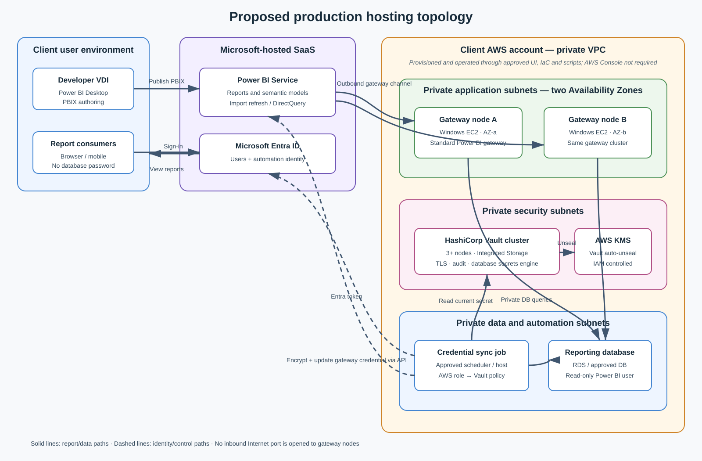
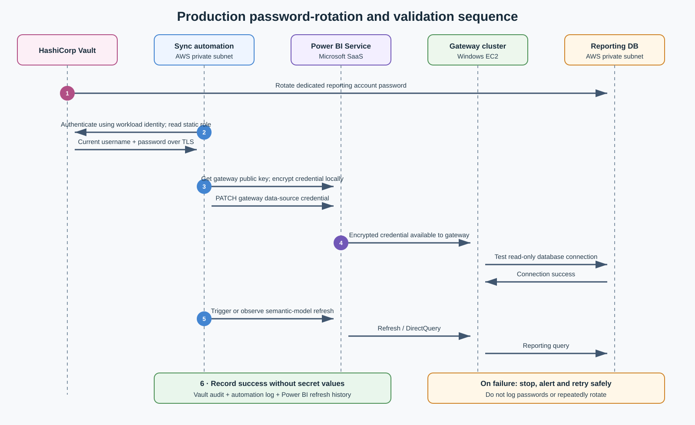

# Power BI and HashiCorp Vault credential-rotation POC

This local proof of concept demonstrates how HashiCorp Vault can manage and rotate a read-only database credential used by a Power BI-like gateway. PostgreSQL, Vault, and the gateway simulator run in Docker Compose under WSL. Power BI Desktop runs natively on Windows and connects to PostgreSQL through `localhost`.

It is deliberately independent of an AWS console, client VDI, and Power BI tenant so the core security behavior can be demonstrated from a personal laptop.

## What this proves

1. A dedicated `powerbi_reader` account can query only reporting data.
2. Vault manages that account as a static database role.
3. After Vault rotates the password, a consumer holding the old password fails.
4. A synchronization job retrieves the current credential from Vault.
5. The consumer succeeds again without placing the password in source control.

The gateway simulator represents the credential cache in the real Microsoft on-premises data gateway. It is not Microsoft gateway software.

## Architecture diagrams

The production diagrams later in this document are SVG files. Select either diagram to open the full-size image and zoom without losing detail.

## Prerequisites

- Windows 10 or 11 with WSL 2
- Docker Desktop with WSL integration, or Docker Engine inside WSL
- Power BI Desktop (optional for the Compose-only test)
- `bash`, `openssl`, and `curl` in WSL

Run all shell commands from a WSL terminal.

## Start the POC

```bash
chmod +x scripts/*.sh scripts/container/*.sh
./scripts/setup.sh
```

The first run downloads and builds the container images, starts PostgreSQL and Vault, configures Vault's PostgreSQL secrets engine, synchronizes the credential, and starts the gateway simulator.

Verify the simulated report:

```bash
curl http://localhost:8080/report
```

## Demonstrate rotation

```bash
./scripts/demo-rotation.sh
```

The demonstration performs a successful query, rotates the password, proves the cached credential fails, synchronizes the replacement credential, and proves queries work again.

Individual operations are also available:

```bash
./scripts/rotate-credential.sh
./scripts/sync-credential.sh
```

## Connect Power BI Desktop

Display the current local reporting credential:

```bash
./scripts/show-powerbi-credentials.sh
```

This command intentionally reveals the password and is for the isolated local POC only.

In Power BI Desktop on Windows:

1. Select **Get data > PostgreSQL database**.
2. Set **Server** to `localhost:5432`.
3. Set **Database** to `reporting`.
4. Select **Import** mode.
5. Choose database authentication and enter `powerbi_reader` plus the displayed password.
6. Select the `sales.monthly_sales` table and load it.
7. Create a visual using `month`, `region`, and `revenue`.
8. Save the PBIX outside this repository, or keep it ignored by Git.

If `localhost` does not reach WSL, run `hostname -I` in WSL and use its first IP address as the server. Windows firewall policy may also affect connectivity.

### Observe Power BI behavior

1. Refresh the report successfully in Power BI Desktop.
2. Run `./scripts/rotate-credential.sh`.
3. Refresh again; it should fail because Desktop cached the previous password.
4. Run `./scripts/show-powerbi-credentials.sh`.
5. In Power BI Desktop, open **File > Options and settings > Data source settings**, edit permissions for the PostgreSQL source, and enter the new password.
6. Refresh again successfully.

This demonstrates that putting a credential in Vault is not enough. Every credential consumer must receive the rotated value.

## Local endpoints

| Endpoint | Purpose |
|---|---|
| `http://localhost:8080/report` | Execute a reporting query through the simulator |
| `http://localhost:8080/health` | Simulator health check |
| `http://localhost:8200` | Local Vault development API/UI |
| `localhost:5432` | PostgreSQL for Power BI Desktop |

All published ports bind to `127.0.0.1` in `compose.yaml`.

## Proposed production environment

This is a reference architecture for client review, not a claim about the client's current infrastructure. It assumes a private AWS-hosted reporting database, self-managed Vault in AWS, Microsoft Power BI Service, and no AWS Console access. The client must confirm its database engine, network boundaries, Vault operating model, Power BI licensing, identity standards, recovery objectives, and approved automation platform.

<a href="docs/images/production-topology.svg">
  
</a>

<sub>Select the diagram to open the full-size, zoomable SVG.</sub>

### Component placement and responsibility

| Component | Proposed hosting location | Runtime and availability | Responsibility | Secret handling |
|---|---|---|---|---|
| Power BI Desktop | Developer VDI or managed Windows workstation | Interactive desktop application | Develop PBIX, Power Query transformations, model and report | Developer credential is separate from the production gateway credential |
| Power BI Service | Microsoft-managed SaaS tenant | Capacity and workspace chosen by client | Host reports and semantic models; initiate Import refresh or DirectQuery | Stores the gateway data-source credential encrypted; never receives a Vault token |
| Gateway cluster | At least two managed Windows EC2 instances in separate AWS Availability Zones | Standard on-premises data gateway in one logical cluster | Maintain outbound Power BI channel and execute database queries | Decrypts the Power BI-managed credential locally; no password in scripts or AMI |
| HashiCorp Vault | Three or more nodes across private AWS subnets, or the client's approved managed Vault offering | TLS, integrated storage or approved backend, health monitoring and backups | Manage the reporting account, rotate its password, enforce policy and produce audit events | Root token prohibited for workloads; tightly scoped machine authentication only |
| AWS KMS | Client AWS account | Customer-managed KMS key with restricted key policy | Auto-unseal a self-managed Vault cluster | Vault EC2 role receives only required KMS operations |
| Credential-sync automation | Client-approved private automation host, scheduler or service | One active scheduled job with retry control and alerting | Read current Vault credential, encrypt it for the gateway, update Power BI, validate and optionally initiate refresh | Uses AWS workload identity for Vault and an approved Entra automation identity for Power BI |
| Reporting database | Private data subnet; for example RDS or another approved AWS database | Multi-AZ and backup settings follow client standards | Serve approved reporting views/tables | Dedicated least-privilege account managed as a Vault static database role |
| Logs and monitoring | Client-approved centralized platforms | Retention and alerts follow client policy | Correlate Vault rotation, synchronization, gateway health and Power BI refresh | Log identifiers and status only—never passwords, Vault tokens or encrypted credential payloads |

### Network paths

| Source | Destination | Required path | Notes |
|---|---|---|---|
| Developer VDI | Power BI Service | HTTPS outbound | Publish reports and administer permitted workspaces |
| Report consumer | Power BI Service | HTTPS outbound | View reports; no direct database or Vault access |
| Gateway EC2 nodes | Power BI Service and Microsoft relay endpoints | Microsoft-documented outbound ports/FQDNs | The standard gateway does not require an inbound Internet port |
| Gateway EC2 nodes | Reporting database | Private database port | Security group permits only gateway-node identities/subnets as approved |
| Sync automation | Vault | HTTPS 8200 or client-standard private endpoint | TLS validation required; authenticate using workload identity |
| Vault | Reporting database | Private database port | Vault rotates only the dedicated reporting account |
| Sync automation | Microsoft Entra ID and Power BI REST API | HTTPS 443 outbound | Obtain token, retrieve gateway public key, update credential and validate |
| Vault nodes | AWS KMS | HTTPS 443 through approved egress or VPC endpoint | Required only for AWS KMS auto-unseal |

Exact Microsoft endpoints and ports must be generated from the supported gateway tooling/documentation and converted into the client's approved firewall scripts. Do not encode changing public IP addresses manually.

### Production credential-rotation sequence

<a href="docs/images/credential-rotation.svg">
  
</a>

<sub>Select the diagram to open the full-size, zoomable SVG.</sub>

1. Vault rotates the password of the dedicated reporting account according to policy or an approved manual event.
2. The synchronization workload authenticates to Vault using its machine identity and reads only the named static role.
3. It requests the gateway public key, encrypts the credential locally, and updates the gateway data source through the Power BI REST API.
4. The gateway decrypts and uses the credential to test a read-only connection to the reporting database.
5. Automation triggers or observes a semantic-model refresh and confirms completion.
6. Vault, automation, gateway and refresh identifiers are correlated in monitoring without recording any secret value.

Rotation must be treated as a coordinated operation. The password changes at the database before Power BI receives the replacement, creating a short failure window. The production design should therefore include bounded retries, alerting, an agreed maintenance window where necessary, and a tested recovery procedure. It must not respond to a synchronization failure by repeatedly rotating the password.

### Identity and authorization boundaries

- **Database account:** read-only access to explicitly approved schemas, views or stored procedures; no DDL or user management.
- **Vault database administrator:** used internally by Vault to rotate the reporting account; protected separately from the reporting credential.
- **Vault synchronization policy:** read access only to `database/static-creds/powerbi-reader` and any narrowly required metadata.
- **AWS workload identity:** attached only to the approved automation runtime and used to authenticate to Vault; no static Vault token in configuration.
- **Power BI automation identity:** limited to the tenant/workspace/gateway operations approved by the Power BI administrator.
- **Human administrators:** separate named identities with audited emergency procedures; no shared root or service credentials.

### Script-only provisioning in the client AWS environment

The disabled AWS Console does not require a different runtime architecture. It changes how the environment is provisioned and inspected. The client-approved automation should cover:

1. Network subnets, security groups, endpoints, DNS and routing.
2. Windows EC2 gateway nodes, patching, service startup and gateway-cluster registration.
3. Vault nodes or managed-Vault connectivity, TLS, KMS auto-unseal, policies and audit devices.
4. Database role creation and grants.
5. Entra application/security-group setup and Power BI administrative approval.
6. Credential-sync deployment, schedule, health check, log collection and alerts.
7. Non-secret status commands that the custom UI can invoke for operational support.

The scripts should be idempotent, environment-parameterized and reviewed through the client's existing source-control and promotion process. Secret values must travel through approved runtime channels, not command-line arguments, generated templates, CI logs or source-controlled parameter files.

### POC-to-production mapping

| Local POC | Production equivalent |
|---|---|
| PostgreSQL container | Client reporting database in a private AWS data subnet |
| Vault development container | Highly available client Vault deployment with TLS, durable storage and audit |
| `powerbi_reader` | Dedicated least-privilege production reporting identity |
| Gateway simulator | Standard Power BI gateway cluster on managed Windows EC2 |
| Credential JSON volume | Power BI's encrypted gateway credential store; no shared JSON file in production |
| Credential-sync shell script | Approved workload-identity-based automation using Vault and Power BI APIs |
| `/report` query | Semantic-model Import refresh or DirectQuery operation |
| Manual rotation demo | Scheduled, monitored and recoverable production rotation workflow |

### Authoritative implementation references

- [Microsoft: Plan Power BI data gateways](https://learn.microsoft.com/power-bi/guidance/powerbi-implementation-planning-data-gateways)
- [Microsoft: Gateway high-availability clusters](https://learn.microsoft.com/data-integration/gateway/service-gateway-high-availability-clusters)
- [Microsoft: Gateway communication and outbound ports](https://learn.microsoft.com/data-integration/gateway/service-gateway-communication)
- [Microsoft: Configure gateway credentials programmatically](https://learn.microsoft.com/power-bi/developer/embedded/configure-credentials)
- [Microsoft: Update a gateway data source](https://learn.microsoft.com/rest/api/power-bi/gateways/update-datasource)
- [HashiCorp: Vault integrated-storage reference architecture](https://developer.hashicorp.com/vault/tutorials/day-one-raft/raft-reference-architecture)
- [HashiCorp: AWS KMS auto-unseal](https://developer.hashicorp.com/vault/tutorials/auto-unseal/autounseal-aws-kms)
- [HashiCorp: Database secrets engine](https://developer.hashicorp.com/vault/docs/secrets/databases)

## Power BI credential lifecycle

- **Desktop authoring:** the developer's Windows Power BI Desktop stores a local data-source credential.
- **Import after publishing:** viewers query imported data; the service/gateway credential is used during refresh.
- **DirectQuery after publishing:** interactive report operations can query the database through the gateway.
- **Rotation:** Power BI does not automatically retrieve a replacement password from Vault; approved automation must synchronize it.

## Reset

```bash
./scripts/reset.sh
```

This removes this Compose project's containers and named volumes. It does not remove images or unrelated Docker resources. Run `./scripts/setup.sh` to create a fresh environment.

## Public-repository checklist

Before committing:

```bash
git status --short
git check-ignore .env
git grep -nEi 'password|token|secret'
```

Review matches: documentation and variable names are expected, but literal client credentials are not. Do not commit `.env`, PBIX files with client data, screenshots containing identifiers, internal URLs, or client configuration.

## Production considerations

This POC intentionally uses Vault development mode. A production design must add:

- TLS and a highly available, persistent Vault deployment
- A narrowly scoped machine identity and Vault policy
- Protected bootstrap and database-administration credentials
- Auditing and monitoring without secret values in logs
- Rotation retry, rollback, and outage handling
- A Windows gateway cluster rather than a single unmanaged host
- Power BI API permissions approved by the tenant administrator
- Separate development, test, and production identities and Vault paths

See [SECURITY.md](SECURITY.md) before presenting or extending the project.
