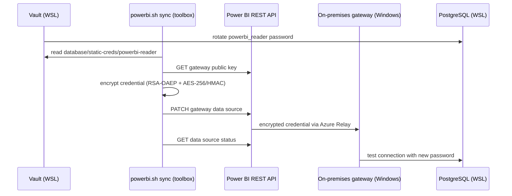
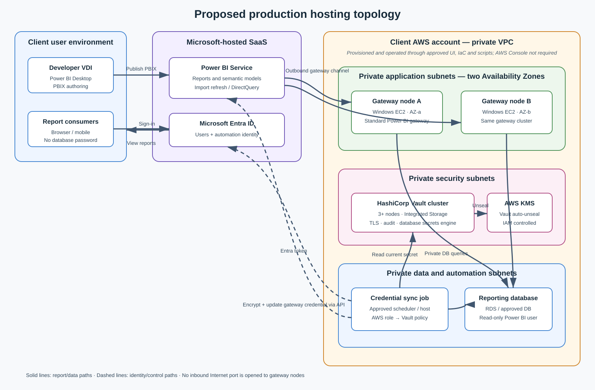
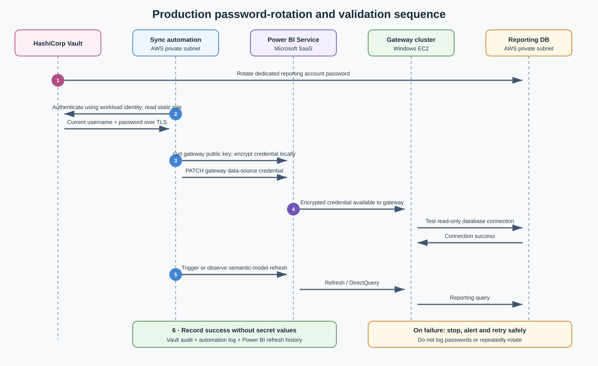

# Power BI and HashiCorp Vault credential-rotation POC

This local proof of concept demonstrates how HashiCorp Vault can manage and rotate a read-only database credential used by the Microsoft on-premises data gateway. PostgreSQL and Vault run in Docker Compose under WSL. Power BI Desktop and the real on-premises data gateway run natively on Windows and reach PostgreSQL through `127.0.0.1:5432` over TLS.

A synchronization job reads the rotated credential from Vault, encrypts it with the gateway's public key, and updates the gateway data source through the Power BI REST API — the same mechanism proposed for production. It needs a Microsoft Entra (work or school) tenant with Power BI, but no AWS console or client VDI.

An offline [gateway simulator](#offline-simulator) is kept for demonstrations where no Power BI tenant is available.

## What this proves

1. A dedicated `powerbi_reader` account can query only reporting data.
2. Vault manages that account as a static database role.
3. After Vault rotates the password, the real gateway's stored credential fails its connection test.
4. A synchronization job retrieves the current credential from Vault, encrypts it for the gateway, and updates the gateway data source through the Power BI REST API.
5. The gateway connects (and, optionally, the semantic model refreshes) again without the password appearing in source control, command lines, logs, or the Power BI UI.

## Architecture diagrams

The production diagrams later in this document are SVG files. Use the **Open zoomable SVG** link below each diagram to bypass GitHub's file-preview page, then use the browser's normal zoom controls.

## Prerequisites

- Windows 10 or 11 with WSL 2
- Docker Desktop with WSL integration, or Docker Engine inside WSL
- Power BI Desktop
- [On-premises data gateway (standard mode)](https://learn.microsoft.com/data-integration/gateway/service-gateway-install) installed on the same Windows machine
- A Microsoft Entra work or school account with Power BI, in a tenant where you can register an app (see [Power BI tenant for testing](#power-bi-tenant-for-testing))
- `bash`, `openssl`, and `curl` in WSL

Run all shell commands from a WSL terminal.

## Setup options

### Automated setup

```bash
chmod +x scripts/*.sh scripts/container/*.sh
./scripts/setup.sh
```

The first run downloads and builds the container images, starts PostgreSQL and Vault, and configures Vault's PostgreSQL secrets engine. Continue with [Use the real Power BI gateway](#use-the-real-power-bi-gateway).

### Vault UI-guided setup

The automated setup is the quickest repeatable way to run the POC. To learn
where the database connection and static reporting role appear in HashiCorp
Vault's web interface, follow the
[Vault UI walkthrough](docs/vault-ui-walkthrough.md).

The walkthrough records the fields actually observed in Vault Community
Edition, the API-assisted fallback for fields the UI does not expose, the
complete credential-rotation result, and the recommended production boundary
between PostgreSQL administration, Vault, and the Power BI reporting account.

Both setup paths produce the same local POC behavior.

## Connect Power BI Desktop

Display the current local reporting credential:

```bash
./scripts/show-powerbi-credentials.sh
```

This command intentionally reveals the password and is for the isolated local POC only.

In Power BI Desktop on Windows:

1. Select **Get data > PostgreSQL database**.
2. Set **Server** to `127.0.0.1:5432`. Use the IP address, not `localhost`: Windows may resolve `localhost` to IPv6 `::1`, where nothing listens.
3. Set **Database** to `reporting`.
4. Select **Import** mode.
5. Choose database authentication and enter `powerbi_reader` plus the displayed password.
6. Select the `sales.monthly_sales` table and load it.
7. Create a visual using `month`, `region`, and `revenue`.
8. Save the PBIX outside this repository, or keep it ignored by Git.

If Desktop shows **Encryption Support** ("unable to connect using an encrypted connection"), the certificate is not yet trusted on Windows; run `scripts/windows/gateway-network.ps1` (see [Windows networking and TLS](#1-windows-networking-and-tls)) rather than accepting an unencrypted connection, because the gateway will not offer that fallback.

### Observe Power BI behavior

1. Refresh the report successfully in Power BI Desktop.
2. Run `./scripts/rotate-credential.sh`.
3. Refresh again; it should fail because Desktop cached the previous password.
4. Run `./scripts/show-powerbi-credentials.sh`.
5. In Power BI Desktop, open **File > Options and settings > Data source settings**, edit permissions for the PostgreSQL source, and enter the new password.
6. Refresh again successfully.

This demonstrates that putting a credential in Vault is not enough. Every credential consumer must receive the rotated value. Desktop is a developer tool and stays manual; the gateway, which serves published reports, is automated next.

## Power BI tenant for testing

The gateway installer's sign-in is a Microsoft Entra sign-in, not a newsletter registration. The gateway registers itself with a Power BI tenant and cannot run without one, and personal addresses (Gmail, Outlook.com) are not accepted. Use a separate, disposable test tenant rather than a personal or client production account:

| Option | Notes |
|---|---|
| Client-provided test account | Preferred. A test user and workspace in the client's development tenant; the client's admin performs the app registration and tenant settings below. |
| Microsoft 365 Developer Program E5 sandbox | Includes Power BI Pro. Eligibility is limited to Visual Studio Professional/Enterprise subscribers, certain Microsoft partner tiers, and Premier/Unified Support customers. |
| Microsoft 365 business trial tenant | Creates `you@<name>.onmicrosoft.com`. Signup asks for a contact email and phone (and may ask for a payment method); an alias address is sufficient. Start a Power BI/Fabric trial as that user. |

Whichever you choose, sign in to the gateway, Power BI Service, and this POC with the `@<tenant>.onmicrosoft.com` (or client) account. Delete the trial tenant when the POC is finished.

## Use the real Power BI gateway


```mermaid
sequenceDiagram
    participant V as Vault (WSL)
    participant S as powerbi.sh sync (toolbox)
    participant P as Power BI REST API
    participant G as On-premises gateway (Windows)
    participant D as PostgreSQL (WSL)
    V->>D: rotate powerbi_reader password
    S->>V: read database/static-creds/powerbi-reader
    S->>P: GET gateway public key
    S->>S: encrypt credential (RSA-OAEP + AES-256/HMAC)
    S->>P: PATCH gateway data source
    P->>G: encrypted credential via Azure Relay
    S->>P: GET data source status
    G->>D: test connection with new password
```

### 1. Windows networking and TLS

The gateway runs as a Windows service, not as your user, which matters in two ways:

- **TLS.** The gateway's PostgreSQL connection is encrypted by default and does not fall back to plain text the way Desktop does. `setup.sh` therefore starts PostgreSQL with a self-signed certificate for `127.0.0.1` (`postgres/tls/`, ignored by Git), and Windows must trust it.
- **Reaching WSL.** With Windows 11 mirrored networking (`networkingMode=mirrored` in `%UserProfile%\.wslconfig`) or Docker Desktop, the service reaches `127.0.0.1:5432` directly. With **Windows 10 and Docker Engine inside WSL**, WSL's `localhost` forwarding is visible to your user only; the gateway gets *"No connection could be made because the target machine actively refused it"*. A Windows port proxy fixes this.

| Setup | `.env` | Administrator PowerShell |
|---|---|---|
| Windows 11 mirrored networking, or Docker Desktop | (nothing) | `.\scripts\windows\gateway-network.ps1 -RepoPath <WSL repo path>` |
| Windows 10, Docker Engine in WSL | `POSTGRES_PUBLISH=0.0.0.0:15432`, then `docker compose up -d postgres` | `.\scripts\windows\gateway-network.ps1 -RepoPath <WSL repo path> -PortProxy` |

Run the PowerShell script from a Windows copy of the repository or through `\\wsl$\<distro>\<repo path>\scripts\windows\`; `-RepoPath` is the path inside WSL, for example `~/sources/powerbi-vault-poc`. With `-PortProxy`, re-run it after every reboot or `wsl --shutdown`, because WSL receives a new IP address. The script trusts the certificate, forwards `127.0.0.1:5432` to the WSL address (detected from `eth0`), and restarts the gateway service. If PowerShell refuses to run scripts, start it with `powershell -ExecutionPolicy Bypass -File ...`.

### 2. Register the gateway

1. Run the on-premises data gateway installer in **standard mode** on Windows.
2. Sign in with the test tenant account and choose **Register a new gateway**.
3. Name it (for example `vault-poc-gateway`) and store the recovery key in your password manager.

### 3. Publish the report and create the gateway connection

A Power BI Pro license (or the 60-day Power BI trial started from your profile picture in Power BI Service) is needed to create a workspace and map gateway connections. A Fabric trial is not required.

1. Build the report in Desktop as described above, using server `127.0.0.1:5432` and database `reporting`, then **Publish** to a workspace.
2. In Power BI Service open **Settings > Manage connections and gateways > Connections > + New** and choose **On-premises** at the top of the panel. A form without a **Gateway cluster name** field creates a *cloud* connection, which Microsoft's servers test from the internet and which fails with *"actively refused"*.
3. Select the gateway cluster, set **Connection type** to PostgreSQL, **Server** to `127.0.0.1:5432`, and **Database** to `reporting`. These must match the PBIX exactly or the semantic model cannot bind to the connection.
4. Choose **Basic** authentication and enter `powerbi_reader` plus the password from `./scripts/show-powerbi-credentials.sh`. Keep **Encrypted connection** set to **Encrypted**. This is the only manual password entry; later rotations are automated.
5. Open the semantic model's **Settings > Gateway and cloud connections**, switch on **Use an On-premises or VNet data gateway**, map the PostgreSQL source to the new connection, and **Apply**. **Refresh now** should succeed.

### 4. Register an Entra application for the sync job

In the Entra admin center, open **App registrations > New registration** (single tenant) and copy the **Directory (tenant) ID** and **Application (client) ID** into `.env`. Then choose one mode:

**Delegated user (`POWERBI_AUTH_MODE=device`, simplest for the POC)**

1. **Authentication > Settings > Allow public client flows: Enabled** (or set `"isFallbackPublicClient": true` in **Manifest**). No redirect URI is needed.
2. **API permissions > Add a permission > Power BI Service > Delegated > `Dataset.ReadWrite.All`**, then **Grant admin consent** (or accept the consent prompt at first sign-in).
3. The signed-in user must be an admin/owner of the gateway connection (the user who created it is).

**Service principal (`POWERBI_AUTH_MODE=service_principal`, closer to production)**

1. Create a client secret and put it in `POWERBI_CLIENT_SECRET` (local POC only; production uses workload identity or a certificate from an approved store).
2. In the Fabric/Power BI admin portal, enable **Service principals can call Fabric public APIs** for a security group that contains the app.
3. In **Manage connections and gateways**, add the service principal to the connection with the **Owner** role, and to the workspace as **Contributor** if it should trigger refreshes.

### 5. Discover IDs and synchronize

```bash
./scripts/powerbi.sh login        # device mode only: prints a code for https://microsoft.com/devicelogin
./scripts/powerbi.sh discover     # lists gateway and data-source IDs
# add POWERBI_GATEWAY_ID and POWERBI_DATASOURCE_ID to .env
# optional: POWERBI_DATASET_ID (and POWERBI_WORKSPACE_ID unless using My workspace) from the semantic model URL, to refresh
./scripts/sync-credential.sh      # Vault -> encrypt -> PATCH gateway data source -> connection test
```

`.env` then contains, for example:

```
POWERBI_AUTH_MODE=device
POWERBI_TENANT_ID=<directory (tenant) ID>
POWERBI_CLIENT_ID=<application (client) ID>
POWERBI_WORKSPACE_ID=<workspace ID from the semantic model URL>
POWERBI_DATASET_ID=<dataset ID from the semantic model URL>
POWERBI_GATEWAY_ID=<from discover>
POWERBI_DATASOURCE_ID=<from discover>
POWERBI_ENCRYPTED_CONNECTION=Encrypted
```

The device-code sign-in is cached in the `powerbi-auth` Docker volume, so later runs are non-interactive until the refresh token expires.

### 6. Demonstrate rotation

```bash
./scripts/demo-rotation.sh
```

The demonstration:

1. Tests the gateway connection (and refreshes the semantic model if configured).
2. Rotates the password in Vault and closes existing `powerbi_reader` sessions, because PostgreSQL keeps authenticated sessions alive and the gateway pools connections.
3. Proves the gateway's stored credential now fails its connection test.
4. Reads the new credential from Vault, encrypts it with the gateway's public key, and updates the data source.
5. Proves the gateway connects (and the refresh succeeds) again.

Observed result (Docker progress lines removed):

```text
1. Gateway connection with the synchronized credential (expect OK)
Gateway connection test: OK
Refresh requested; waiting for completion...
Refresh completed.
2. Rotate the database password in Vault
Vault rotated the database password.
Closed 2 existing powerbi_reader session(s).
3. Gateway still holds the old password (expect FAILED)
Gateway connection test: FAILED (HTTP 400) DM_GWPipeline_Gateway_MashupDataAccessError
4. Encrypt the new Vault credential for the gateway and update the data source
Gateway data source updated from Vault (Vault rotation time: 2026-09-28T01:04:35.805476134Z).
5. Gateway connection again (expect OK)
Gateway connection test: OK
Refresh requested; waiting for completion...
Refresh completed.
Rotation demonstration against the real gateway completed successfully.
```

### Troubleshooting

| Symptom | Cause | Fix |
|---|---|---|
| Gateway installer asks for an email | It is a Microsoft Entra sign-in; personal addresses are rejected | Use a test-tenant account ([Power BI tenant for testing](#power-bi-tenant-for-testing)) |
| Creating a workspace asks for a purchase | Account has only the free Power BI license | Start the Power BI trial from your profile picture |
| *"actively refused"* when creating the connection, and the form has no gateway field | A cloud connection was being created | Create it from **Connections > + New > On-premises** |
| *"actively refused"* on an on-premises connection | Gateway service cannot reach WSL (Windows 10 NAT) | `POSTGRES_PUBLISH=0.0.0.0:15432` and `gateway-network.ps1 -PortProxy` |
| *"Unable to connect ... encrypted connection"* / Desktop **Encryption Support** prompt | Certificate not trusted, or PostgreSQL without TLS | Run `gateway-network.ps1`; check `docker compose exec postgres psql -U postgres -tAc "show ssl"` returns `on` |
| Everything broke after a reboot (Windows 10) | WSL IP address changed | Re-run `gateway-network.ps1 -PortProxy` |
| `Missing POWERBI_...` from `powerbi.sh` | Value absent from `.env` | Add it; `grep POWERBI_ .env` to check |

Individual operations:

```bash
./scripts/rotate-credential.sh
./scripts/sync-credential.sh
./scripts/powerbi.sh status
./scripts/powerbi.sh refresh
```

The credential is encrypted inside the toolbox container before it leaves your machine; Power BI Service stores only the encrypted value, which only the gateway can decrypt. The encryption code in `scripts/container/powerbi_gateway.py` is a port of [Microsoft's Python credential-encryption sample](https://github.com/microsoft/PowerBI-Developer-Samples/tree/master/Python/Encrypt%20credentials).

## Offline simulator

When no Power BI tenant is available, the original simulator demonstrates the same rotation behavior with a stand-in for the gateway's credential cache. It is not Microsoft gateway software.

```bash
./scripts/simulator/demo-rotation.sh
curl http://localhost:8080/report
```

## Local endpoints

| Endpoint | Purpose |
|---|---|
| `http://localhost:8200` | Local Vault development API/UI |
| `127.0.0.1:5432` | PostgreSQL (TLS) for Power BI Desktop and the on-premises data gateway |
| `http://localhost:8080/report` | Offline simulator only |

All published ports bind to `127.0.0.1` in `compose.yaml`.

## Proposed production environment

This is a reference architecture for client review, not a claim about the client's current infrastructure. It assumes a private AWS-hosted reporting database, self-managed Vault in AWS, Microsoft Power BI Service, and no AWS Console access. The client must confirm its database engine, network boundaries, Vault operating model, Power BI licensing, identity standards, recovery objectives, and approved automation platform.

<a href="https://raw.githubusercontent.com/pramalin/powerbi-vault-poc/main/docs/images/production-topology.svg">
  
</a>

[**Open zoomable production-topology SVG**](https://raw.githubusercontent.com/pramalin/powerbi-vault-poc/main/docs/images/production-topology.svg)

### Component placement and responsibility

| Component | Proposed hosting location | Runtime and availability | Responsibility | Secret handling |
|---|---|---|---|---|
| Power BI Desktop | Developer VDI or managed Windows workstation | Interactive desktop application | Develop PBIX, Power Query transformations, model and report | Developer credential is separate from the production gateway credential |
| Power BI Service | Microsoft-managed SaaS tenant | Capacity and workspace chosen by client | Host reports and semantic models; initiate Import refresh or DirectQuery | Stores the gateway data-source credential encrypted; never receives a Vault token |
| Gateway cluster | At least two managed Windows EC2 instances in separate AWS Availability Zones | Standard on-premises data gateway in one logical cluster | Maintain outbound Power BI channel and execute database queries | Decrypts the Power BI-managed credential locally; no password in scripts or AMI |
| HashiCorp Vault | Three or more nodes across private AWS subnets, or the client's approved managed Vault offering | TLS, integrated storage or approved backend, health monitoring and backups | Manage the reporting account, rotate its password, enforce policy and produce audit events | Root token prohibited for workloads; tightly scoped machine authentication only |
| AWS KMS | Client AWS account | Customer-managed KMS key with restricted key policy | Auto-unseal a self-managed Vault cluster | Vault EC2 role receives only required KMS operations |
| Credential-sync automation | Client-approved private automation host, scheduler or service | One active scheduled job with retry control and alerting | Read current Vault credential, encrypt it for the gateway, update Power BI, validate and optionally initiate refresh | Uses AWS workload identity for Vault and an approved Entra automation identity for Power BI |
| Reporting database | Private data subnet; for example RDS or another approved AWS database | Multi-AZ and backup settings follow client standards | Serve approved reporting views/tables | Dedicated least-privilege account managed as a Vault static database role |
| Logs and monitoring | Client-approved centralized platforms | Retention and alerts follow client policy | Correlate Vault rotation, synchronization, gateway health and Power BI refresh | Log identifiers and status only—never passwords, Vault tokens or encrypted credential payloads |

### Network paths

| Source | Destination | Required path | Notes |
|---|---|---|---|
| Developer VDI | Power BI Service | HTTPS outbound | Publish reports and administer permitted workspaces |
| Report consumer | Power BI Service | HTTPS outbound | View reports; no direct database or Vault access |
| Gateway EC2 nodes | Power BI Service and Microsoft relay endpoints | Microsoft-documented outbound ports/FQDNs | The standard gateway does not require an inbound Internet port |
| Gateway EC2 nodes | Reporting database | Private database port | Security group permits only gateway-node identities/subnets as approved |
| Sync automation | Vault | HTTPS 8200 or client-standard private endpoint | TLS validation required; authenticate using workload identity |
| Vault | Reporting database | Private database port | Vault rotates only the dedicated reporting account |
| Sync automation | Microsoft Entra ID and Power BI REST API | HTTPS 443 outbound | Obtain token, retrieve gateway public key, update credential and validate |
| Vault nodes | AWS KMS | HTTPS 443 through approved egress or VPC endpoint | Required only for AWS KMS auto-unseal |

Exact Microsoft endpoints and ports must be generated from the supported gateway tooling/documentation and converted into the client's approved firewall scripts. Do not encode changing public IP addresses manually.

### Production credential-rotation sequence

<a href="https://raw.githubusercontent.com/pramalin/powerbi-vault-poc/main/docs/images/credential-rotation.svg">
  
</a>

[**Open zoomable credential-rotation SVG**](https://raw.githubusercontent.com/pramalin/powerbi-vault-poc/main/docs/images/credential-rotation.svg)

1. Vault rotates the password of the dedicated reporting account according to policy or an approved manual event.
2. The synchronization workload authenticates to Vault using its machine identity and reads only the named static role.
3. It requests the gateway public key, encrypts the credential locally, and updates the gateway data source through the Power BI REST API.
4. The gateway decrypts and uses the credential to test a read-only connection to the reporting database.
5. Automation triggers or observes a semantic-model refresh and confirms completion.
6. Vault, automation, gateway and refresh identifiers are correlated in monitoring without recording any secret value.

Rotation must be treated as a coordinated operation. The password changes at the database before Power BI receives the replacement, creating a short failure window. The production design should therefore include bounded retries, alerting, an agreed maintenance window where necessary, and a tested recovery procedure. It must not respond to a synchronization failure by repeatedly rotating the password.

### Identity and authorization boundaries

- **Database account:** read-only access to explicitly approved schemas, views or stored procedures; no DDL or user management.
- **Vault database administrator:** used internally by Vault to rotate the reporting account; protected separately from the reporting credential.
- **Vault synchronization policy:** read access only to `database/static-creds/powerbi-reader` and any narrowly required metadata.
- **AWS workload identity:** attached only to the approved automation runtime and used to authenticate to Vault; no static Vault token in configuration.
- **Power BI automation identity:** limited to the tenant/workspace/gateway operations approved by the Power BI administrator.
- **Human administrators:** separate named identities with audited emergency procedures; no shared root or service credentials.

### Script-only provisioning in the client AWS environment

The disabled AWS Console does not require a different runtime architecture. It changes how the environment is provisioned and inspected. The client-approved automation should cover:

1. Network subnets, security groups, endpoints, DNS and routing.
2. Windows EC2 gateway nodes, patching, service startup and gateway-cluster registration.
3. Vault nodes or managed-Vault connectivity, TLS, KMS auto-unseal, policies and audit devices.
4. Database role creation and grants.
5. Entra application/security-group setup and Power BI administrative approval.
6. Credential-sync deployment, schedule, health check, log collection and alerts.
7. Non-secret status commands that the custom UI can invoke for operational support.

The scripts should be idempotent, environment-parameterized and reviewed through the client's existing source-control and promotion process. Secret values must travel through approved runtime channels, not command-line arguments, generated templates, CI logs or source-controlled parameter files.

### POC-to-production mapping

| Local POC | Production equivalent |
|---|---|
| PostgreSQL container | Client reporting database in a private AWS data subnet |
| Vault development container | Highly available client Vault deployment with TLS, durable storage and audit |
| `powerbi_reader` | Dedicated least-privilege production reporting identity |
| Single gateway on the developer's Windows machine | Standard Power BI gateway cluster on managed Windows EC2 |
| `powerbi_gateway.py sync` with a Vault root token and device-code or client-secret sign-in | Approved automation using workload identity for Vault and a certificate/managed identity for Entra |
| `powerbi.sh status` / `refresh` | Post-rotation validation and monitored semantic-model refresh |
| Manual rotation demo | Scheduled, monitored and recoverable production rotation workflow |

### Authoritative implementation references

- [Microsoft: Plan Power BI data gateways](https://learn.microsoft.com/power-bi/guidance/powerbi-implementation-planning-data-gateways)
- [Microsoft: Gateway high-availability clusters](https://learn.microsoft.com/data-integration/gateway/service-gateway-high-availability-clusters)
- [Microsoft: Gateway communication and outbound ports](https://learn.microsoft.com/data-integration/gateway/service-gateway-communication)
- [Microsoft: Configure gateway credentials programmatically](https://learn.microsoft.com/power-bi/developer/embedded/configure-credentials)
- [Microsoft: Update a gateway data source](https://learn.microsoft.com/rest/api/power-bi/gateways/update-datasource)
- [HashiCorp: Vault integrated-storage reference architecture](https://developer.hashicorp.com/vault/tutorials/day-one-raft/raft-reference-architecture)
- [HashiCorp: AWS KMS auto-unseal](https://developer.hashicorp.com/vault/tutorials/auto-unseal/autounseal-aws-kms)
- [HashiCorp: Database secrets engine](https://developer.hashicorp.com/vault/docs/secrets/databases)

## Power BI credential lifecycle

- **Desktop authoring:** the developer's Windows Power BI Desktop stores a local data-source credential.
- **Import after publishing:** viewers query imported data; the service/gateway credential is used during refresh.
- **DirectQuery after publishing:** interactive report operations can query the database through the gateway.
- **Rotation:** Power BI does not automatically retrieve a replacement password from Vault; approved automation must synchronize it.

## Reset

```bash
./scripts/reset.sh
```

This removes this Compose project's containers and named volumes. It does not remove images or unrelated Docker resources. Run `./scripts/setup.sh` to create a fresh environment.

## Public-repository checklist

Before committing:

```bash
git status --short
git check-ignore .env
git grep -nEi 'password|token|secret'
```

Review matches: documentation and variable names are expected, but literal client credentials are not. Do not commit `.env`, PBIX files with client data, screenshots containing identifiers, internal URLs, or client configuration.

## Production considerations

This POC intentionally uses Vault development mode. A production design must add:

- TLS and a highly available, persistent Vault deployment
- A narrowly scoped machine identity and Vault policy
- Protected bootstrap and database-administration credentials
- Auditing and monitoring without secret values in logs
- Rotation retry, rollback, and outage handling
- A Windows gateway cluster rather than a single unmanaged host
- No client secret or Vault root token in `.env`; use workload identity and certificates
- Power BI API permissions approved by the tenant administrator
- Separate development, test, and production identities and Vault paths

See [SECURITY.md](SECURITY.md) before presenting or extending the project.

