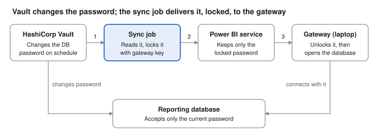

# Power BI + Vault POC: What We Found

As of 27 September 2026

## In one minute

**The client's idea works.** HashiCorp Vault can own the database password that Power BI uses, change it on a schedule, and hand the new one to Power BI automatically, with no person ever seeing or typing it.

We proved this on 27 September 2026 against the **real** Microsoft on-premises data gateway, not a simulator. After Vault changed the password, Power BI's copy stopped working; one command then delivered the new password and the report refreshed again.

Two things matter for the client:

- **Vault alone is not enough.** Power BI never asks Vault for the password. A small sync job must push each new password into Power BI. That job is the heart of this design.
- **Most of the day went on setup, not on the idea.** Test accounts, licensing, Windows networking and encryption caused the delays. The same issues will appear in the client's environment in a different form, so they are listed below with what each one means.

## How it works

Five parts take part. Only one of them, the **sync job**, is new; the rest already exist at the client.

- **Vault** changes the reporting account's password inside the database. From that moment the old password no longer works.
- **1** The sync job asks Vault for the new password.
- **2** It locks the password with a key that only the client's gateway can unlock, then hands it to Power BI through Microsoft's official interface (the "REST API").
- **3** Power BI passes the locked password on to the gateway. Power BI itself never sees the password in readable form.
- The **gateway** unlocks it and uses it to read the database when a report refreshes.

The sync job then asks the gateway to test the connection, so a failure is caught immediately instead of at the next report refresh.

## What we proved today

One command, `./scripts/demo-rotation.sh`, ran the whole cycle against the real gateway and passed every step.

| Step | What happened | Result |
| --- | --- | --- |
| 1 | Gateway tested its connection; the report refreshed | OK, refresh completed |
| 2 | Vault changed the database password and closed 2 open sessions | Done |
| 3 | Gateway tested again, still holding the old password | **Failed**, as intended |
| 4 | Sync job fetched the new password from Vault and delivered it, locked, to the gateway | Updated |
| 5 | Gateway tested again; the report refreshed | OK, refresh completed |

Step 3 matters as much as step 5. It shows that changing the password really does cut off an old copy, so the sync job is doing real work rather than passing a password that never changed.

At no point was the password typed, displayed, stored in a file, or sent to Power BI in readable form. The only manual password entry was the very first setup of the gateway connection.

## What got in the way, and what it means for the client

None of these obstacles was a flaw in the idea. Each one is a setup detail the client's team will also meet, so each row says what to plan for.

| Obstacle | What happened today | What it means for the client |
| --- | --- | --- |
| Gateway needs a work account | The gateway refused a personal email. We created a separate test organisation. | The gateway must be registered with an account in the client's own Microsoft organisation. Decide who owns it. |
| Licensing | Creating a workspace asked for a purchase until the free 60-day Power BI trial was started. The Fabric trial was not offered. | Confirm the workspace and the automation account have the Power BI licences they need. |
| Cloud vs on-premises connection | The first connection form made a *cloud* connection, so Microsoft's servers tried to reach the database and were refused. | Gateway connections must be created as **On-premises**. Put this in the runbook. |
| Encryption is required | The gateway would only connect over an encrypted link. Power BI Desktop had quietly fallen back to an unencrypted one. | The client's database needs encryption (TLS) with a certificate the gateway machines trust. Good practice anyway. |
| Laptop networking | On Windows 10 the gateway service could not see the database inside WSL. A Windows port forwarder fixed it; it must be re-run after each reboot. | Laptop-only. In production, the network rules must still allow the gateway machines to reach the database. |
| `localhost` vs `127.0.0.1` | Windows looked up `localhost` on a different address where nothing was listening. | The server name in the report and in the gateway connection must match exactly. Use one agreed name. |
| Old sessions survive a password change | Connections already open kept working with the old password, hiding the effect of rotation. | Decide whether rotation should end open sessions. Schedule rotation outside report refresh times. |
| Short gap after each rotation | Between Vault changing the password and the sync finishing, refreshes fail. | Run the sync immediately after rotation, retry on failure, alert if it keeps failing, and never respond by rotating again. |

## Recommendations for production

The design can go forward. These are the changes between today's laptop demo and a production setup.

1. **Run the sync job as a machine, not a person.** Today it signed in as a user with a one-time code. In production it should use an app identity (a "service principal") with a certificate. This mode is built into the POC but was **not tested today**.
2. **Let the sync job read one thing only.** Its Vault access should cover just the reporting account's password, using the platform's machine identity instead of a stored Vault token.
3. **Tie the sync to every rotation.** Trigger it right after Vault rotates, retry a few times, alert on failure, and follow it with a report refresh check.
4. **Encrypt the database connection.** Use TLS with a certificate the gateway machines trust, and keep the gateway's "Encrypted" setting on.
5. **Run two or more gateway machines.** A gateway cluster keeps reports refreshing if one machine is down or being patched.
6. **Rotate outside refresh windows.** Agree a time slot so the brief gap after each rotation does not hit a scheduled refresh.
7. **Next proof step:** repeat this demo in the client's development environment, using the service principal mode and their real database.

## Running the demo again

After a restart of the laptop, four steps bring it back.

- [ ] Open Ubuntu (WSL), go to the repo folder and start the containers: `docker compose up -d`
- [ ] Make sure the **On-premises data gateway** app shows **Online**
- [ ] In an **Administrator** PowerShell, re-create the port forwarder (WSL's address changes on every restart): `powershell -ExecutionPolicy Bypass -File \\wsl$\<distro>\<repo path>\scripts\windows\gateway-network.ps1 -RepoPath <repo path in WSL> -PortProxy`
- [ ] Back in WSL, run `./scripts/sync-credential.sh`, then `./scripts/demo-rotation.sh`

If the Power BI sign-in has expired, run `./scripts/powerbi.sh login` first. The README's **Troubleshooting** table lists every error seen and its fix.

## Glossary

| Term | Plain meaning |
| --- | --- |
| HashiCorp Vault | A secure safe for passwords that can also change them automatically on a schedule ("rotation"). |
| On-premises data gateway | Microsoft software on a Windows machine near the database. It lets the Power BI cloud reach a private database without opening it to the internet. |
| Power BI service | The Power BI website (app.powerbi.com) where published reports live and refresh. |
| Semantic model | The data behind a published report; "refresh" reloads it from the database. |
| Gateway connection | The saved server name, database name and password the gateway uses. On-premises connections run through the gateway; cloud connections do not. |
| Sync job | The small program in this POC (`scripts/container/powerbi_gateway.py`) that carries each new password from Vault to the gateway. |
| Gateway public key | A lock only the gateway can open. The sync job locks the password with it, so Power BI stores it but cannot read it. |
| REST API | Microsoft's official way for a program to change Power BI settings instead of a person clicking. |
| Microsoft Entra ID | Microsoft's account system for organisations; the gateway and Power BI sign-ins use it. |
| Service principal | An account for a program rather than a person; recommended for the production sync job. |
| TLS / encrypted connection | Scrambling traffic between the gateway and the database so it cannot be read on the network. |
| WSL | Windows Subsystem for Linux: runs the database and Vault on the laptop. |
| Port forwarder | A Windows setting that passes connections from `127.0.0.1:5432` into WSL, needed on Windows 10. |
